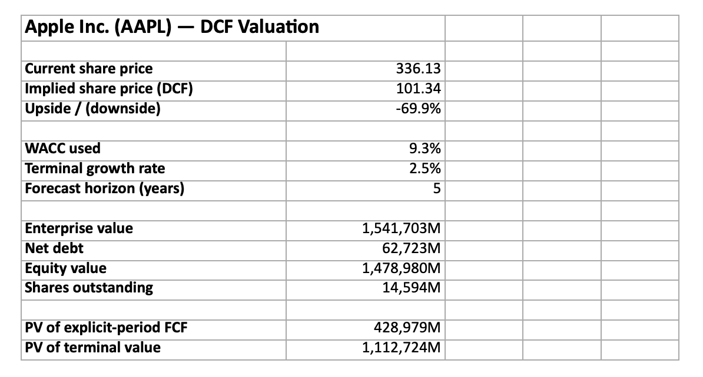

# Company Valuation Model

A DCF and comparable companies valuation tool: give it a stock ticker, and
it pulls the company's real historical financials, projects free cash flow
forward, values the business, and writes a formatted Excel report — the
same output an analyst would build by hand in a financial model, generated
in seconds instead of an afternoon. Optionally pass a set of peer tickers
and it adds a comps analysis (P/E, EV/EBITDA, EV/Revenue) alongside the
DCF, so the report shows two independent valuation methods side by side
instead of a single number.



*Summary sheet from a real run on AAPL — Excel report generated by the tool, not hand-built.*

## What it actually does

1. **Pulls real financials** for any public ticker via Yahoo Finance
   (revenue, EBIT, D&A, capex, debt, cash, shares outstanding, beta).
2. **Derives assumptions from history** — revenue CAGR, EBIT margin, D&A
   and capex as a % of revenue, effective tax rate — any of which you can
   override.
3. **Projects unlevered free cash flow** for a configurable number of years:
   `NOPAT + D&A − Capex − Δ Net Working Capital`.
4. **Computes WACC** via CAPM (cost of equity from beta, blended with
   after-tax cost of debt), or accepts a WACC you supply directly.
5. **Discounts the cash flows** and adds a Gordon-growth terminal value to
   get enterprise value, then backs into equity value and an implied
   per-share price.
6. **Builds a sensitivity table** showing how the implied price moves
   across a range of WACC and terminal growth assumptions — because a DCF
   is only as good as its two most debatable inputs, and any real model
   should show that range rather than hide behind one number.
7. **Writes it all to a formatted Excel workbook** (Summary, Assumptions,
   FCF Projection, and a colour-scaled Sensitivity grid).
8. **Optionally runs a comparable companies analysis** — pass `--comps` with
   a list of peer tickers, and it pulls each peer's trading multiples
   (P/E, EV/EBITDA, EV/Revenue) from Yahoo Finance, averages them, and
   applies them to the target's own EBITDA/revenue/EPS to get an implied
   price under each method. Adds a Comps sheet with the peer table and a
   football-field chart comparing the DCF, comps, and market price.

## Running it

```bash
python3 -m venv venv
source venv/bin/activate       # On Windows: venv\Scripts\activate
pip install -r requirements.txt
python3 main.py AAPL
```

This prints a quick summary to the terminal and writes `AAPL_valuation.xlsx`
in the current folder.

### Overriding assumptions

Every judgment call in the model can be overridden from the command line —
useful since "what the last 4 years looked like" is rarely exactly what you
believe about the next 5:

```bash
python3 main.py MSFT --years 7 --terminal-growth 0.03
python3 main.py TSLA --wacc 0.11 --growth 0.15 --margin 0.12
python3 main.py KO --risk-free-rate 0.045 --market-risk-premium 0.055
```

Run `python3 main.py --help` for the full list of overridable assumptions.

### Adding a comps analysis

```bash
python3 main.py AAPL --comps MSFT,GOOGL,META
```

This adds a Comps sheet to the Excel report alongside the DCF, so you can
see where the two methods agree and where they don't — a DCF built on a
low historical growth rate can imply a much lower price than trading
multiples do, and that gap is usually more informative than either number
on its own.

## Running the tests

```bash
python3 -m pytest tests/ -v
```

29 tests cover statement parsing (against a hand-built DataFrame shaped
like Yahoo Finance's real output, so no network access is needed to run
the suite), the forecasting math, the DCF and WACC calculations, the
sensitivity grid, and the comps multiples/averaging logic.

## Methodology notes

- **This is a simplified DCF**, not a full three-statement model — net
  working capital is approximated as a percentage of the change in
  revenue rather than built up from a full balance sheet schedule. That's
  a standard simplification for a quick valuation; a more rigorous build
  would model receivables, payables, and inventory separately.
- **Terminal value** uses the Gordon growth (perpetuity) method rather
  than an exit-multiple approach. Both are common in practice; perpetuity
  growth is more defensible when you don't want to assume a specific
  future trading multiple.
- **WACC** defaults to a CAPM-based estimate using the company's own beta
  from Yahoo Finance, a configurable risk-free rate and market risk
  premium, and a flat assumed cost of debt — all of which are simplifying
  assumptions real analysts would refine with market data on the
  company's actual bond yields.
- **Comps use Yahoo Finance's own precomputed ratios** (`trailingPE`,
  `enterpriseValue`, `ebitda`, `totalRevenue`) rather than being re-derived
  from historical statements — a comps analysis only needs today's
  snapshot, not a multi-year history, so it's fetched independently of
  the DCF's data. A peer with missing or negative EBITDA (common for
  early-stage or distressed companies) is dropped from the average rather
  than distorting it.
- **This is not investment advice.** It's a demonstration of DCF and
  comps mechanics and financial modeling automation, not a substitute
  for professional equity research.

## Project structure

```
company-valuation-model/
├── valuation/
│   ├── models.py       # CompanyFinancials, Assumptions, DCFResult dataclasses
│   ├── data.py          # Yahoo Finance fetch + pure statement parsing
│   ├── forecast.py      # Derives assumptions from history, projects FCF
│   ├── dcf.py            # WACC, discounting, terminal value, valuation
│   ├── sensitivity.py    # WACC x terminal-growth sensitivity grid
│   ├── comps.py           # Peer trading multiples + comparable companies analysis
│   └── report.py         # Excel report generation (openpyxl)
├── main.py               # CLI entry point
├── tests/
└── requirements.txt
```

## Possible extensions

- A full three-statement model (income statement, balance sheet, cash
  flow statement all linked) instead of the simplified FCF build
- Exit-multiple terminal value as an alternative to Gordon growth
- A simple web front end (Streamlit) instead of the CLI
